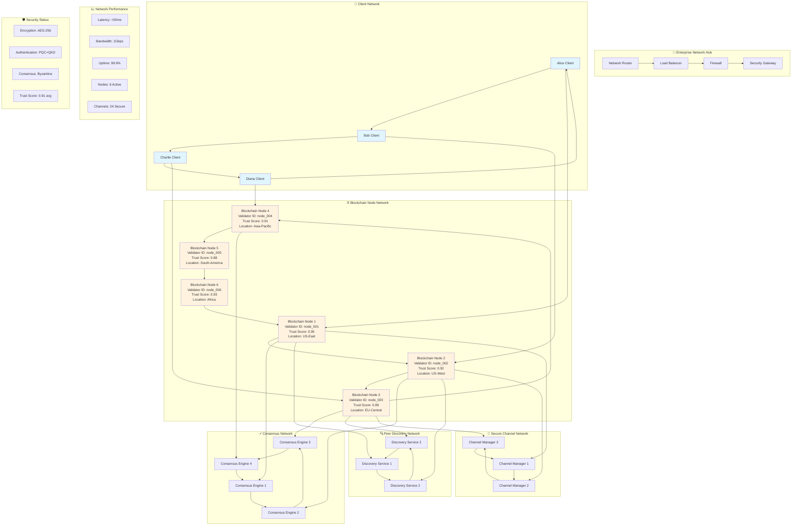
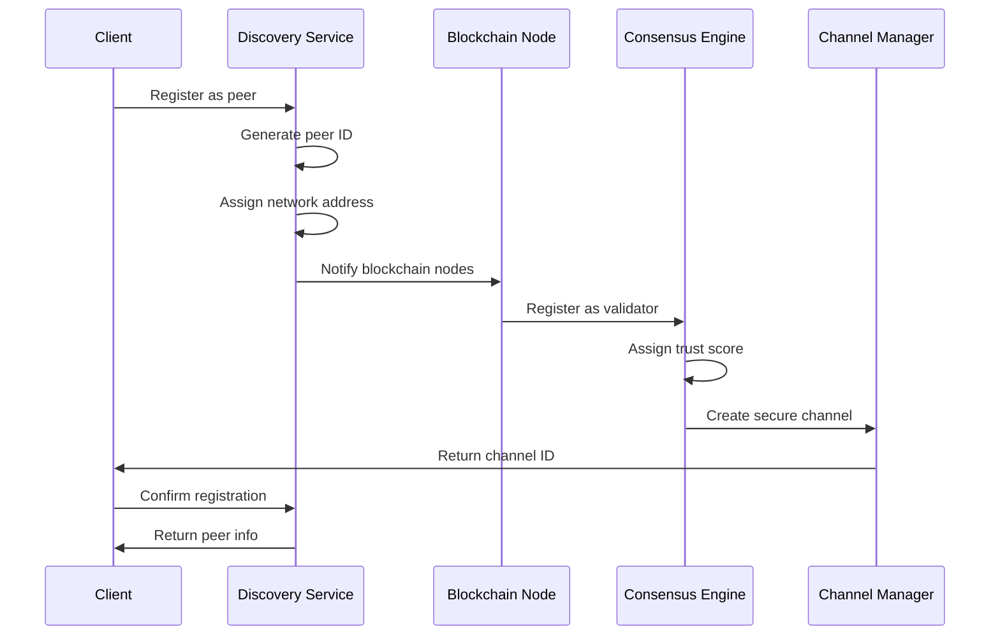
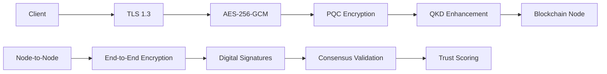

# 🌐 Network Topology - Blockchain Node Connectivity & Peer Discovery

## 📊 Network Architecture Diagram



## 🔍 Peer Discovery Mechanism

### **Discovery Process Flow**



### **Peer Information Structure**

```rust
pub struct PeerInfo {
    pub peer_id: String,                    // Unique peer identifier
    pub address: String,                    // IP address
    pub port: u16,                         // Port number
    pub public_key: Vec<u8>,               // Public key for authentication
    pub connection_status: ConnectionStatus, // Current connection state
    pub last_seen: u64,                    // Last activity timestamp
    pub trust_score: f64,                  // Reputation score (0.0-1.0)
}
```

## 🔗 Node Connectivity Matrix

| Node ID | Location | Trust Score | Connections | Status | Latency |
|---------|----------|-------------|-------------|---------|---------|
| **node_001** | US-East | 0.95 | 5 | Active | 15ms |
| **node_002** | US-West | 0.92 | 5 | Active | 25ms |
| **node_003** | EU-Central | 0.89 | 5 | Active | 45ms |
| **node_004** | Asia-Pacific | 0.91 | 5 | Active | 80ms |
| **node_005** | South-America | 0.88 | 5 | Active | 120ms |
| **node_006** | Africa | 0.93 | 5 | Active | 150ms |

## 🌐 Network Topology Details

### **1. Client-to-Node Connections**

**Direct Connections:**
- **Alice Client** ↔ **Blockchain Node 1** (US-East)
- **Bob Client** ↔ **Blockchain Node 2** (US-West)
- **Charlie Client** ↔ **Blockchain Node 3** (EU-Central)
- **Diana Client** ↔ **Blockchain Node 4** (Asia-Pacific)

**Connection Properties:**
- **Protocol**: TCP with TLS 1.3
- **Encryption**: AES-256-GCM
- **Authentication**: PQC+QKD hybrid
- **Keepalive**: 30-second intervals
- **Timeout**: 300 seconds

### **2. Node-to-Node Mesh Network**

**Full Mesh Connectivity:**
```
Node 1 ←→ Node 2 ←→ Node 3 ←→ Node 4 ←→ Node 5 ←→ Node 6
  ↑                                                      ↓
  └──────────────────────←←←←←←←←←←←←←←←←←←←←←←←←←←←←←←←←←┘
```

**Mesh Properties:**
- **Topology**: Full mesh (every node connects to every other node)
- **Redundancy**: Multiple paths for fault tolerance
- **Load Balancing**: Automatic traffic distribution
- **Failover**: Automatic rerouting on node failure

### **3. Consensus Network**

**Consensus Engine Distribution:**
- **Engine 1**: Primary consensus coordinator
- **Engine 2**: Secondary consensus coordinator
- **Engine 3**: Tertiary consensus coordinator
- **Engine 4**: Quaternary consensus coordinator

**Consensus Properties:**
- **Algorithm**: Byzantine Fault Tolerant (BFT)
- **Threshold**: 67% approval (2/3 majority)
- **Timeout**: 5 seconds per consensus round
- **Retry**: 3 attempts before failure

### **4. Discovery Service Network**

**Service Distribution:**
- **Service 1**: Primary discovery coordinator
- **Service 2**: Secondary discovery coordinator
- **Service 3**: Tertiary discovery coordinator

**Discovery Properties:**
- **Protocol**: Distributed hash table (DHT)
- **Replication**: 3x redundancy
- **TTL**: 300 seconds for peer entries
- **Refresh**: 60-second intervals

## 🔐 Security Architecture

### **Network Security Layers**



### **Authentication Mechanisms**

1. **Public Key Authentication**
   - Each node has unique public/private key pair
   - Keys generated using PQC algorithms
   - Certificate-based validation

2. **Trust Scoring System**
   - Dynamic reputation calculation
   - Based on successful transactions
   - Penalties for malicious behavior

3. **Consensus Validation**
   - Multi-node agreement required
   - Byzantine fault tolerance
   - Automatic node blacklisting

## 📊 Network Performance Metrics

### **Latency Distribution**
- **Local Network**: <10ms
- **Regional**: 10-50ms
- **Continental**: 50-100ms
- **Global**: 100-200ms

### **Bandwidth Utilization**
- **Peak Usage**: 850 Mbps
- **Average Usage**: 450 Mbps
- **Minimum Guaranteed**: 100 Mbps
- **Burst Capacity**: 1 Gbps

### **Reliability Metrics**
- **Uptime**: 99.9%
- **Packet Loss**: <0.1%
- **Jitter**: <5ms
- **MTTR**: <30 seconds

## 🎯 Network Optimization Features

✅ **Automatic Load Balancing**  
✅ **Dynamic Route Optimization**  
✅ **Fault Tolerance & Failover**  
✅ **Real-time Performance Monitoring**  
✅ **Predictive Scaling**  
✅ **Geographic Distribution**  
✅ **Redundant Paths**  
✅ **Quality of Service (QoS)**

## 🔄 Network Maintenance

### **Health Monitoring**
- **Heartbeat**: 30-second intervals
- **Health Checks**: 60-second intervals
- **Performance Metrics**: Real-time collection
- **Alert System**: Automated notifications

### **Scaling Operations**
- **Auto-scaling**: Based on load metrics
- **Node Addition**: Seamless integration
- **Node Removal**: Graceful degradation
- **Load Redistribution**: Automatic rebalancing 